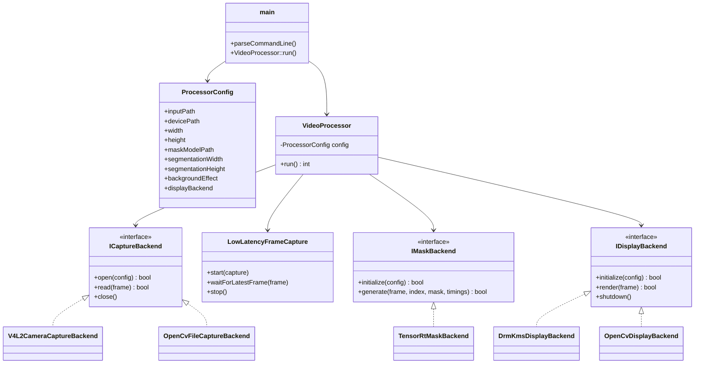
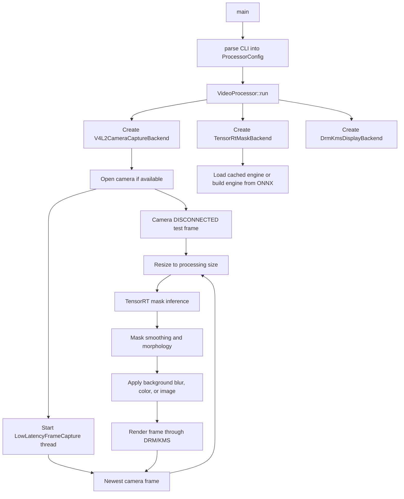

# Architecture

This document describes the current production-oriented path only: V4L2 camera input, TensorRT mask generation, background effect rendering, and DRM/KMS or HighGUI display output.

## Main Classes



## Standard Call Flow

Typical DRM blur call:

```bash
./JONImageProcessor --device /dev/video0 --processing-size 1280x720 --mask-model "$MODEL_PATH" --segmentation-size 384x384 --background-effect blur --display-backend drm --fullscreen --benchmark
```



For camera input, failed startup open or USB disconnect does not terminate the process. The pipeline renders a `Camera DISCONNECTED` test image and periodically attempts to reopen the configured V4L2 device after the device node has been visible for a short settle period. Reconnect is accepted after the reopened V4L2 device delivers a valid frame. If runtime IPC sets `camera.enabled=false`, camera capture is stopped and a `Camera OFF` test image is rendered. When it is enabled again, `Camera OFF` remains visible during the reconnect grace period before falling back to `Camera DISCONNECTED`.

For DRM/KMS output, a missing display connector at service startup does not terminate the process. The display backend is retried periodically, and camera capture is delayed until display initialization succeeds.

For `--input <path>`, `OpenCvFileCaptureBackend` is used instead of V4L2 and frames are processed sequentially. For `--display-backend highgui`, `OpenCvDisplayBackend` replaces the DRM/KMS backend.

For `--background-effect image`, the image is loaded once at startup and resized to the processed output frame size before compositing.

## Ownership Boundaries

- `CommandLineOptions` owns CLI parsing and validation only.
- `VideoProcessor` owns the frame pipeline and timing.
- Capture backends only deliver BGR `cv::Mat` frames.
- `TensorRtMaskBackend` owns TensorRT engine loading/building and mask inference.
- Display backends only render the already composited output frame.

## Model And Engine Files

The ONNX model is portable and should be treated as the source model. The generated `.engine` file is a TensorRT plan optimized for a specific TensorRT/CUDA/GPU environment and input size. It can be cached on the Jetson to avoid repeated startup builds, but it should not be treated as a universal artifact.
