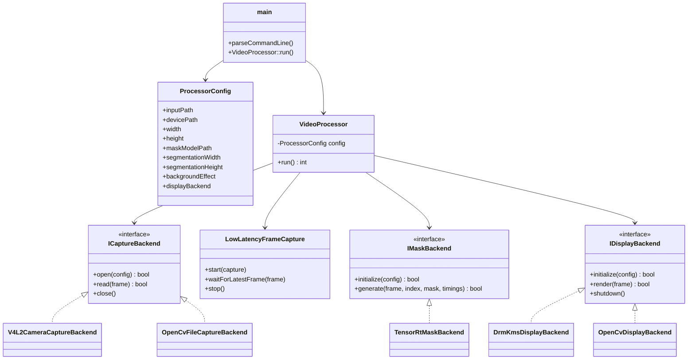
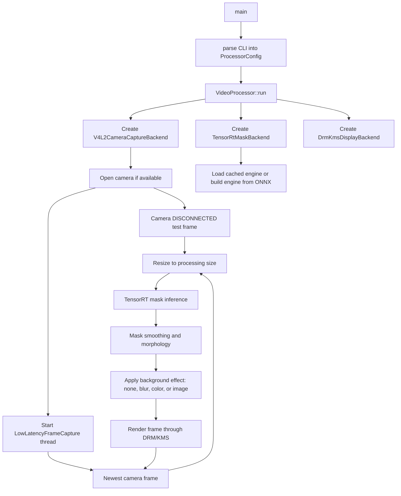

# Architecture

This document describes the current production-oriented path only: V4L2 camera input, TensorRT mask generation, background effect rendering, and DRM/KMS or HighGUI display output.

## Main Classes


```mermaid
classDiagram
    class main {
        +parseCommandLine()
        +VideoProcessor::run()
    }

    class ProcessorConfig {
        +inputPath
        +devicePath
        +width
        +height
        +maskModelPath
        +segmentationWidth
        +segmentationHeight
        +backgroundEffect
        +displayBackend
    }

    class VideoProcessor {
        -ProcessorConfig config
        +run() int
    }

    class ICaptureBackend {
        <<interface>>
        +open(config) bool
        +read(frame) bool
        +close()
    }

    class V4L2CameraCaptureBackend
    class OpenCvFileCaptureBackend

    class LowLatencyFrameCapture {
        +start(capture)
        +waitForLatestFrame(frame)
        +stop()
    }

    class IMaskBackend {
        <<interface>>
        +initialize(config) bool
        +generate(frame, index, mask, timings) bool
    }

    class TensorRtMaskBackend

    class IDisplayBackend {
        <<interface>>
        +initialize(config) bool
        +render(frame) bool
        +shutdown()
    }

    class DrmKmsDisplayBackend
    class OpenCvDisplayBackend

    main --> ProcessorConfig
    main --> VideoProcessor
    VideoProcessor --> ICaptureBackend
    ICaptureBackend <|.. V4L2CameraCaptureBackend
    ICaptureBackend <|.. OpenCvFileCaptureBackend
    VideoProcessor --> LowLatencyFrameCapture
    VideoProcessor --> IMaskBackend
    IMaskBackend <|.. TensorRtMaskBackend
    VideoProcessor --> IDisplayBackend
    IDisplayBackend <|.. DrmKmsDisplayBackend
    IDisplayBackend <|.. OpenCvDisplayBackend
```

## Standard Call Flow

Typical DRM blur call:

```bash
./JONImageProcessor --device /dev/video0 --processing-size 1280x720 --mask-model "$MODEL_PATH" --segmentation-size 384x384 --background-effect blur --display-backend drm --fullscreen --benchmark
```


```mermaid
flowchart TD
    A[main] --> B[parse CLI into ProcessorConfig]
    B --> C[VideoProcessor::run]
    C --> D[Create V4L2CameraCaptureBackend]
    D --> E[Open camera if available]
    E --> Fallback[Camera DISCONNECTED test frame]
    E --> LC[Start LowLatencyFrameCapture thread]
    C --> F[Create TensorRtMaskBackend]
    F --> G[Load cached engine or build engine from ONNX]
    C --> H[Create DrmKmsDisplayBackend]
    LC --> I[Newest camera frame]
    Fallback --> J
    I --> J[Resize to processing size]
    J --> K[TensorRT mask inference]
    K --> L[Mask smoothing and morphology]
    L --> M[Apply background effect: none, blur, color, or image]
    M --> N[Render frame through DRM/KMS]
    N --> I
```

For camera input, failed startup open or USB disconnect does not terminate the process. The pipeline renders a `Camera DISCONNECTED` status screen and periodically attempts to reopen the configured V4L2 device after the device node has been visible for a short settle period. Reconnect is accepted after the reopened V4L2 device delivers a valid frame. If runtime IPC sets `camera.enabled=false` while the camera is open, capture stays open and the capture thread continues draining frames, but the processing pipeline renders a `Camera OFF` status screen instead of the live frame. This avoids a USB/V4L2 close/reopen cycle for normal runtime pauses. If the camera had not been opened yet, enabling it later uses the reconnect path and renders `Camera connecting...` during the reconnect grace period before falling back to `Camera DISCONNECTED`. These status screens use the generated test pattern by default. When `pause.enabled=true`, `pause.source=image` uses the configured pause image/video/HTML media, and `pause.source=camera` reads frames from `secondaryCamera.pipeline` through a background GStreamer `appsink` worker. If `pause.preserveAspectRatio=true`, secondary camera pause frames are letterboxed into the output canvas instead of stretched. Missing or failing secondary camera pipelines render `Camera 2. DISCONNECTED`.

For DRM/KMS output, a missing display connector at service startup does not terminate the process. The display backend is retried periodically, and camera capture is delayed until display initialization succeeds.

For `--input <path>`, `OpenCvFileCaptureBackend` is used instead of V4L2 and frames are processed sequentially. For `--display-backend highgui`, `OpenCvDisplayBackend` replaces the DRM/KMS backend.

For `--background-effect none`, the processed camera frame is passed through without background replacement. For `--background-effect image`, the media file is loaded and resized to the processed output frame size before compositing.

TensorRT mask preprocessing uses aspect-ratio-preserving letterboxing instead of stretching the camera frame to the model input size. RGB input is normalized to `[-1..1]` for MODNet-style matting models. The model output is cropped back to the non-padded content region before it is resized to the processing frame. The mask postprocess path keeps a weak foreground region when it was foreground in the previous frame, then applies the configured morphology mode to grow and feather the alpha mask.

## Runtime Configuration

The IPC server updates a shared runtime `ProcessorConfig`. Single-key `set` requests and overlay config requests both validate a full candidate config first; if validation succeeds, the new config is copied into the running processor and is picked up on subsequent frames.

Overlay configs are selected with IPC key `config`. The value is a safe base name without `.json`; the file is loaded from the read-only `configDirectory` configured in the main JSON file. Overlay files are optional, and an empty active config name means no overlay is selected. Missing or invalid overlay files return an IPC JSON error and leave the previous runtime config unchanged. Overlay names may contain only letters, digits, `_`, and `-`, so path traversal and absolute paths cannot be expressed through IPC. Overlay files use the same grouped JSON shape as the main configuration, but `configDirectory` inside an overlay is ignored.

Runtime-active fields include segmentation threshold, smoothing, morphology, background effect/media, pause source/media/text settings, camera enabled state (`camera.enabled` in JSON and IPC), no-mask/no-overlay, and benchmark collection. Startup-only fields such as display backend, IPC socket path, processing size, segmentation model path, primary camera device path, and `secondaryCamera.pipeline` are not reinitialized by applying an overlay and require a service restart.

## Ownership Boundaries

- `CommandLineOptions` owns CLI parsing and validation only.
- `VideoProcessor` owns the frame pipeline and timing.
- Capture backends only deliver BGR `cv::Mat` frames.
- `TensorRtMaskBackend` owns TensorRT engine loading/building and mask inference.
- Display backends only render the already composited output frame.

## Model And Engine Files

The ONNX model is portable and should be treated as the source model. The generated `.engine` file is a TensorRT plan optimized for a specific TensorRT/CUDA/GPU environment and input size. It can be cached on the Jetson to avoid repeated startup builds, but it should not be treated as a universal artifact.
